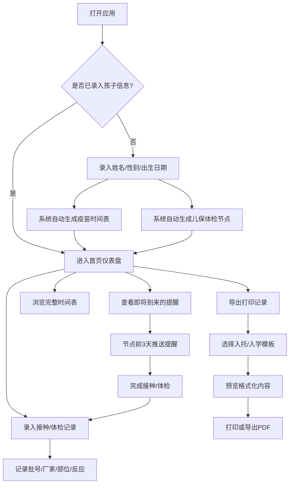

## 1. 产品概述

婴幼儿疫苗接种与儿保体检全程管家是一款专为新手父母打造的健康管理工具，通过录入孩子出生日期，系统自动按照国家免疫规划生成全套疫苗接种时间表和儿保体检节点，并提供智能提醒、详细记录和标准化导出功能，帮助父母科学有序地管理孩子的健康成长。

- 目标用户：0-6岁婴幼儿的新手父母
- 核心价值：解决父母记不住接种时间、遗漏体检、记录混乱、入托入学材料整理繁琐等痛点

## 2. 核心功能

### 2.1 用户角色
| 角色 | 注册方式 | 核心权限 |
|------|----------|----------|
| 父母用户 | 无需注册，本地存储 | 录入孩子信息、查看时间表、管理记录、导出打印 |

### 2.2 功能模块
1. **首页仪表盘**：孩子信息概览、即将到来的提醒、快速操作入口
2. **疫苗接种时间表**：按国家免疫规划自动生成的完整疫苗接种计划
3. **儿保体检时间表**：对应月龄的儿童保健体检节点安排
4. **提醒中心**：节点前3天智能提醒，提醒状态管理
5. **接种记录管理**：录入疫苗批号、生产厂家、接种部位、当日反应等详情
6. **导出打印中心**：按入托/入学要求格式化导出接种记录

### 2.3 页面详情
| 页面名称 | 模块名称 | 功能描述 |
|-----------|-------------|---------------------|
| 首页仪表盘 | 孩子信息卡 | 显示孩子姓名、性别、出生日期、当前月龄 |
| 首页仪表盘 | 今日提醒 | 显示3天内即将到期的接种/体检提醒 |
| 首页仪表盘 | 完成进度 | 显示疫苗接种和体检完成百分比 |
| 首页仪表盘 | 快捷入口 | 快速跳转至各功能模块 |
| 孩子信息页 | 信息录入 | 录入孩子姓名、性别、出生日期 |
| 孩子信息页 | 信息编辑 | 修改孩子基本信息 |
| 疫苗时间表 | 时间轴列表 | 按月龄展示所有疫苗接种节点及状态 |
| 疫苗时间表 | 详情卡片 | 展示疫苗名称、预防疾病、接种部位、禁忌说明 |
| 儿保体检表 | 时间轴列表 | 按月龄展示所有体检节点及项目 |
| 儿保体检表 | 详情卡片 | 展示体检项目、发育指标、注意事项 |
| 提醒中心 | 提醒列表 | 所有待提醒/已提醒/已完成的事项 |
| 提醒中心 | 提醒设置 | 开关提醒、设置提醒提前天数（默认3天） |
| 接种记录页 | 记录列表 | 按时间倒序展示所有接种/体检记录 |
| 接种记录页 | 新增记录 | 录入疫苗批号、厂家、部位、反应等信息 |
| 接种记录页 | 编辑记录 | 修改已有记录详情 |
| 导出打印页 | 模板选择 | 入托/入学/自定义三种导出模板 |
| 导出打印页 | 预览区 | 实时预览格式化的导出内容 |
| 导出打印页 | 操作按钮 | 打印、导出PDF、复制到剪贴板 |

## 3. 核心流程

用户首次打开应用 → 录入孩子基本信息（姓名、性别、出生日期） → 系统根据国家免疫规划自动计算并生成完整的疫苗接种时间表和儿保体检节点 → 每日检查即将到来的节点，提前3天推送提醒 → 父母在完成接种/体检后录入详细记录（批号、厂家、部位、反应等） → 入托/入学前选择对应模板一键格式化导出打印所有记录。

## 4. 用户界面设计

### 4.1 设计风格
- **主色调**：柔和薄荷绿 (#34D399) - 传达健康、安心、自然的育儿理念
- **辅助色**：温暖珊瑚粉 (#F97316) - 用于提醒和强调，温暖亲切
- **中性色**：米白背景 (#FEFCE8)、柔和灰 (#F8FAFC)、深文字 (#1E293B)
- **按钮风格**：圆角胶囊形按钮，柔和阴影，悬停微上浮效果
- **字体**：标题使用"ZCOOL KuaiLe"(站酷快乐体)活泼可爱，正文使用"Noto Sans SC"清晰易读
- **布局风格**：卡片式布局，大量留白，柔和圆角（16px），温暖渐变背景
- **图标风格**：lucide-react 线性图标，配合可爱emoji增加亲和力

### 4.2 页面设计概览
| 页面名称 | 模块名称 | UI元素 |
|-----------|-------------|-------------|
| 首页仪表盘 | 孩子信息卡 | 渐变背景卡片，头像占位，月龄动态计算，柔和阴影 |
| 首页仪表盘 | 今日提醒 | 时间线式提醒列表，彩色状态标签，倒计时显示 |
| 首页仪表盘 | 完成进度 | 环形进度条，渐变色填充，带动画效果 |
| 疫苗时间表 | 时间轴列表 | 左侧月龄时间轴，右侧卡片交替排列，状态徽章 |
| 接种记录页 | 记录表单 | 分组表单，标签+输入框，温柔过渡动画 |
| 导出打印页 | 预览区 | 仿A4纸张效果，带网格背景阴影，打印专用样式 |

### 4.3 响应式设计
- **设计方式**：桌面优先设计，移动端自适应
- **断点设置**：sm(640px) 平板竖屏、md(768px) 平板横屏、lg(1024px) 小屏笔记本
- **移动端优化**：侧边栏转为底部Tab导航，卡片全宽排列，触摸目标≥44px
- **打印优化**：专门的 @media print 样式，去除导航和装饰元素，确保A4纸张完美适配

### 4.4 动画与微交互
- 页面加载：子元素错峰淡入（stagger 100ms）
- 卡片悬停：轻微上浮 + 阴影加深
- 提醒标记：脉冲动画吸引注意
- 进度条：数字滚动动画
- 表单提交：成功勾选动画
