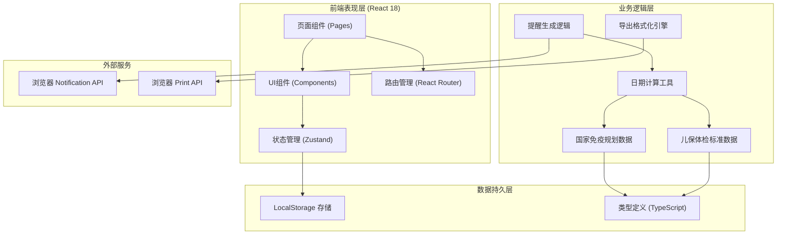
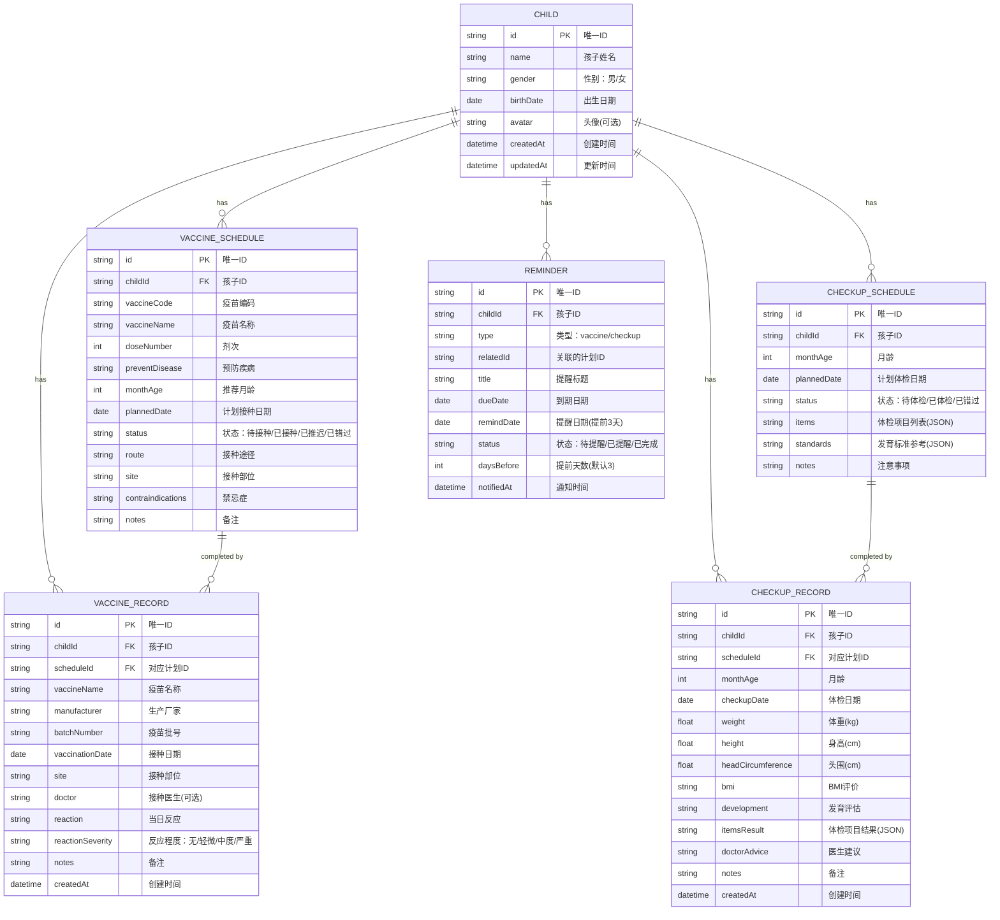

## 1. 架构设计



## 2. 技术描述
- **前端框架**：React@18 + TypeScript@5
- **构建工具**：Vite@5
- **样式方案**：TailwindCSS@3 + CSS Variables
- **路由管理**：React Router DOM@6
- **状态管理**：Zustand@4（轻量、简洁、TS友好）
- **图标库**：Lucide React（线性图标，现代风格）
- **数据存储**：浏览器 LocalStorage（纯前端，无需后端）
- **初始化工具**：vite-init（react-ts 模板）

## 3. 路由定义
| 路由路径 | 页面组件 | 用途 |
|----------|----------|------|
| / | Dashboard | 首页仪表盘，概览信息和快捷入口 |
| /child-info | ChildInfo | 孩子信息录入与编辑 |
| /vaccine-schedule | VaccineSchedule | 疫苗接种时间表 |
| /checkup-schedule | CheckupSchedule | 儿保体检时间表 |
| /reminders | Reminders | 提醒中心 |
| /records | Records | 接种/体检记录管理 |
| /export | ExportPrint | 导出打印中心 |

## 4. 数据模型

### 4.1 数据模型ER图



### 4.2 国家免疫规划疫苗数据结构

```typescript
// 国家免疫规划疫苗基础数据（参考中国疾控中心最新标准）
interface VaccineDefinition {
  code: string;          // 疫苗编码，如 'BCG'
  name: string;          // 疫苗全称
  shortName: string;     // 简称
  preventDisease: string;// 预防疾病
  doses: DoseInfo[];     // 各剂次信息
  route: string;         // 接种途径
  contraindications: string[]; // 禁忌症
  commonReactions: string[];   // 常见反应
  category: '一类' | '二类';  // 疫苗类别
}

interface DoseInfo {
  doseNumber: number;    // 第几剂
  monthAgeMin: number;   // 最小月龄
  monthAgeMax: number;   // 最大月龄（窗口期）
  recommendedMonthAge: number; // 推荐月龄
  site: string;          // 推荐接种部位
  intervalAfterPrevious?: number; // 与上一剂间隔天数
}

// 儿保体检标准数据
interface CheckupDefinition {
  monthAge: number;
  items: CheckupItem[];
  standards: DevelopmentalStandards;
  notes: string[];
}

interface CheckupItem {
  name: string;
  category: '体格测量' | '全身检查' | '发育评估' | '辅助检查' | '其他';
  description: string;
}

interface DevelopmentalStandards {
  weight: { boy: { min: number; max: number; median: number }; girl: { min: number; max: number; median: number } };
  height: { boy: { min: number; max: number; median: number }; girl: { min: number; max: number; median: number } };
  milestones: string[]; // 发育里程碑
}
```

## 5. 工具函数核心逻辑

### 5.1 日期计算工具
- `calculateMonthAge(birthDate: Date, targetDate?: Date): number` - 计算月龄
- `addMonths(date: Date, months: number): Date` - 日期加减月份
- `formatDate(date: Date, format?: string): string` - 日期格式化
- `getDaysBetween(date1: Date, date2: Date): number` - 计算天数差
- `generateVaccineDates(birthDate: Date): VaccineSchedule[]` - 根据出生日期生成接种计划

### 5.2 提醒逻辑
- 应用启动时扫描所有未完成的计划
- 计算距今日 ≤ 提前天数(默认3天)且未提醒的事项
- 调用浏览器 Notification API 推送桌面通知
- 更新提醒状态为"已提醒"

### 5.3 导出格式化
- 支持三种模板：入托版、入学版、完整版
- 生成 HTML 表格（适合打印）
- 调用 window.print() 打印
- 预留导出 PDF 接口（可集成 html2pdf.js）
